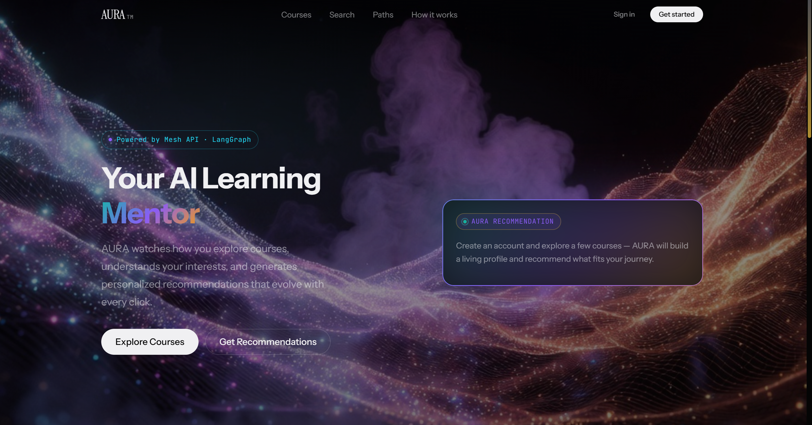
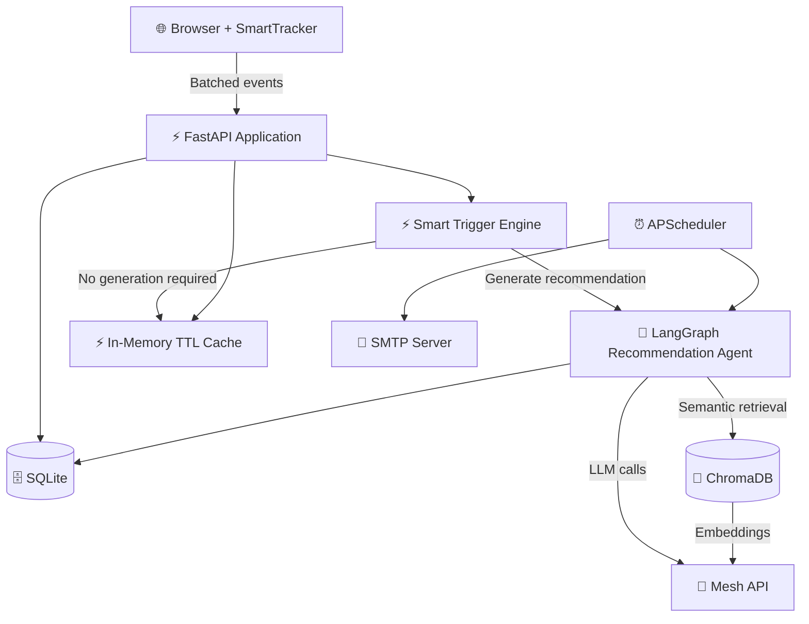
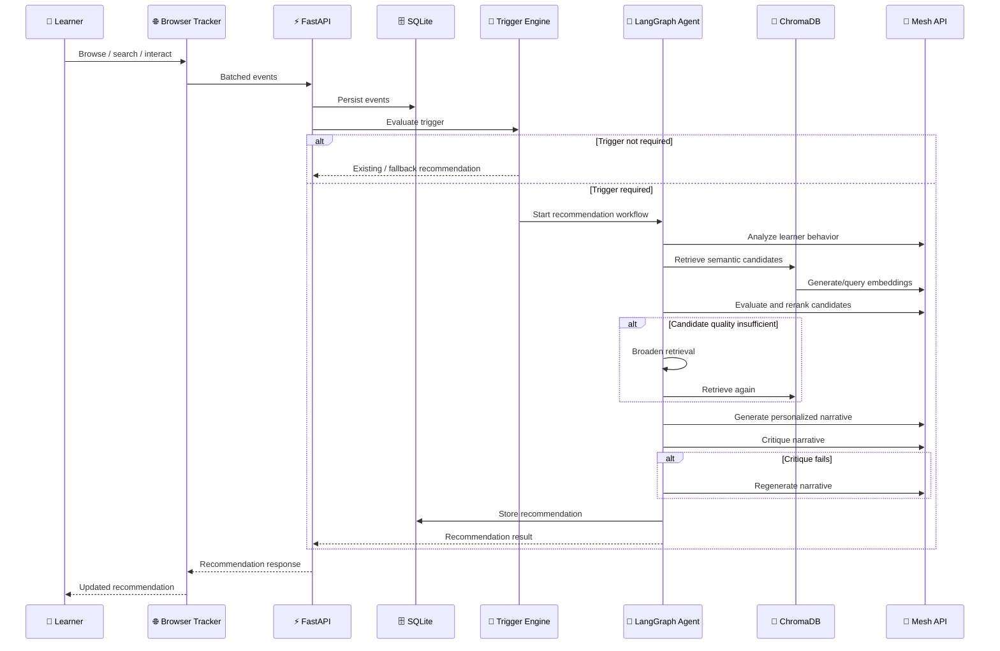

# ✨ AURA SmartReco

> **An agentic, behavior-aware recommendation platform for personalized course discovery — powered by LangGraph, Mesh API, SQLite, and ChromaDB.**

[](https://www.python.org/)
[](https://fastapi.tiangolo.com/)
[](https://langchain-ai.github.io/langgraph/)
[](https://www.trychroma.com/)
[](https://www.sqlite.org/)
[](LICENSE)

**Repository:** https://github.com/Karthikeya63056/AURA_SmartReco

---

## 🧭 Table of Contents

- [🌌 Overview](#-overview)
- [🎥 Live Demo](#-live-demo--walkthrough)
- [🎯 Why AURA?](#-why-aura)
- [✨ Features](#-features)
- [🏗️ Architecture](#️-architecture)
- [🤖 Agentic Recommendation Engine](#-agentic-recommendation-engine)
- [🔄 Recommendation Flow](#-recommendation-flow)
- [🧰 Tech Stack](#-tech-stack)
- [📁 Project Structure](#-project-structure)
- [⚙️ Prerequisites](#️-prerequisites)
- [🚀 Installation](#-installation)
- [▶️ Running AURA](#️-running-aura)
- [🗄️ Database & Vector Store](#️-database--vector-store)
- [🔑 Authentication](#-authentication)
- [🌐 API Reference](#-api-reference)
- [🧪 Testing](#-testing)
- [📈 Evaluation](#-evaluation)
- [🔒 Security](#-security)
- [👨‍💻 Development](#-development)
- [🤝 Contributing](#-contributing)
- [📚 Documentation](#-documentation)
- [❓ FAQ](#-faq)
- [📄 License](#-license)
- [💬 Support](#-support)

---

## 🖥️ Dashboard Preview



> AURA's dashboard brings learner activity, recommendations, and personalized insights together in one interface.

## 🌌 Overview

**AURA SmartReco** is a full-stack educational recommendation platform designed to make course discovery **behavior-aware, contextual, and adaptive**.

Instead of showing the same catalog to every learner, AURA observes supported interaction signals such as:

- 👀 Course views
- 🖱️ Course clicks
- 🔎 Searches
- ❤️ Wishlist / interest actions
- 📚 Syllabus views
- ⏱️ Time spent on pages
- 📣 Course impressions
- 🎯 Recommendation clicks
- Recommendation dismissals

These signals are collected by the browser tracker, validated and persisted by the backend, evaluated by a smart trigger engine, and — when appropriate — passed into an agentic recommendation workflow.

The recommendation workflow then:

1. 🧠 Analyzes learner behavior
2. 🔎 Builds a semantic retrieval query
3. 📚 Retrieves relevant courses from ChromaDB
4. 🎯 Evaluates and reranks candidates
5. 🔄 Broadens retrieval when candidate quality is insufficient
6. ✍️ Generates a personalized recommendation narrative
7. 🧐 Critiques the generated narrative
8. ♻️ Retries generation when validation fails
9. 💾 Stores the final recommendation

For learners without enough behavioral history, AURA provides a popular/trending course fallback rather than immediately requiring personalized agent execution.

---

## 🎥 Live Demo & Walkthrough

<p align="center">
  <a href="https://www.youtube.com/watch?v=DTa-bOqlpYc">
    
  </a>
</p>

> **In this video:** See the behavioral tracker in action, watch the LangGraph agent reason over user intent in real-time, inspect the admin traces, and see the proactive daily digest email land in an inbox.

---

## 🎯 Why AURA?

Unlike traditional recommenders that primarily surface popular or category-matched courses, AURA acts as an **agentic learning mentor**.

It observes learner behavior, understands the learner's journey, retrieves relevant courses, and crafts a **personalized, persuasive narrative** explaining why a specific course makes sense *right now*.

> **AURA doesn't just recommend courses. It explains why they matter.**

## ✨ Features

### 🧠 Behavior-Aware Recommendations

AURA tracks supported learner interactions and uses them as contextual signals for recommendation generation.

The browser tracker batches events before sending them to the backend:

- Every **5 seconds**
- When the queue reaches **20 events**
- During page unload using `navigator.sendBeacon`

---

### ⚡ Smart Trigger Engine

The recommendation agent is **not invoked for every event**.

The trigger layer evaluates behavioral conditions including:

- Cold-start state
- High-intent behavior
- Session activity
- Search signals
- Recommendation staleness
- Manual refresh
- Behavior changes
- Cooldowns

This prevents unnecessary recommendation generation and reduces unnecessary LLM/API usage.

---

### 🤖 Agentic Recommendation Workflow

The recommendation engine is implemented as a compiled LangGraph `StateGraph`.

The workflow contains:

```text
Analyze
   ↓
Retrieve
   ↓
Evaluate
   ├── Insufficient quality
   │        ↓
   │   Broaden Query
   │        ↓
   │     Retrieve
   │
   └── ✅ Acceptable quality
            ↓
       Generate Narrative
            ↓
          Critique
          ├── ♻️ Retry
          │     ↓
          │   Generate
          │
          └── 💾 Store
```

---

### 🔎 Semantic Course Retrieval

Courses are represented semantically inside ChromaDB.

A custom `MeshEmbeddingFunction` routes embedding requests through the configured Mesh API endpoint.

This allows learner intent and course content to be compared semantically rather than relying only on exact keyword matching.

---

### 🎯 Candidate Evaluation & Reranking

Retrieved candidates are evaluated before the final recommendation set is produced.

If candidate quality is insufficient, the agent can broaden its retrieval strategy and try again.

---

### ✍️ Personalized Recommendation Narratives

AURA does not stop at a list of course IDs.

The agent generates a personalized narrative containing recommendation reasoning and product-specific explanations.

The narrative adapts its **persuasion style** (analytical, motivational, social, practical, or hybrid) based on the learner's detected learning preferences.

---

### 🧐 Narrative Critique & Self-Correction

Generated narratives pass through a critique stage.

When validation fails, the workflow can regenerate the narrative subject to the configured retry limit.

This introduces a feedback loop inside the recommendation workflow rather than treating the first generated response as final.

**Grounding validation** ensures narratives mention real courses from the catalog — zero hallucinations.

---

### 🧊 Cold-Start Fallback

Learners without enough behavioral history can still receive useful recommendations.

AURA falls back to popular/trending courses when personalized recommendation context is insufficient.

---

### 🔐 Authentication & Authorization

AURA supports:

- User registration
- Password-based login
- **Password reset via email** (with 15-minute token expiration)
- JWT access tokens
- HttpOnly browser authentication cookies
- Bearer-token API authentication
- Administrator authorization
- bcrypt password hashing

---

### 🛠️ Admin Dashboard

Administrators can:

- 📊 Inspect catalog statistics
- 📦 Manage products
- 👤 Inspect recent user activity
- 🤖 Inspect recommendation traces
- 📈 View recommendation outcomes
- 📬 Trigger the daily digest job manually

---

### 📬 Daily Recommendation Digest

APScheduler runs a daily digest at **09:00**.

The digest:

1. Finds users active during the previous 24 hours
2. Generates personalized recommendations via the full agent workflow
3. Resolves recommended courses
4. Sends a **beautiful HTML email** with gradient branding, course cards, and direct links
5. Adapts greeting to time of day (morning/afternoon/evening)

Administrators can trigger the digest manually via the admin dashboard for immediate delivery.

---

### 📈 Recommendation Outcome Tracking

AURA records recommendation interactions such as:

- Clicks
- Dismissals

The admin reporting layer exposes aggregate metrics including:

- Total recommendations
- Total clicks
- Total dismissals
- Overall CTR
- Per-recommendation interaction metrics

---

### 🧪 Synthetic-Agent Evaluation

The repository contains an evaluation harness with **9 synthetic learner personas** (8 active + 1 cold-start test).

The evaluation measures:

- Trigger rate
- Precision@5
- Recall@5
- Narrative relevance (LLM-as-Judge)
- **Personalization divergence** (Jaccard distance between persona recommendations)
- **Grounding rate** (narrative mentions real courses)
- **Persuasion style adaptation**
- Self-correction stats (refetch count, critique retries)
- Average evaluation duration
- Overall weighted score

---

## 🏗️ Architecture



---

## 🤖 Recommendation Engine

### 🧠 Agent at a Glance

**🧠 Analyze → 🔎 Retrieve → 🎯 Evaluate → ✍️ Generate → 🧐 Critique → 💾 Store**

The recommendation state is defined in:

```text
app/agent/state.py
```

The state contains:

- `user_id`
- `trigger_reason`
- `current_behavior_hash`
- `events_summary`
- `recurring_patterns`
- `user_profile`
- `user_skills`
- `persuasion_style`
- `search_query`
- `candidates`
- `quality_score`
- `refetch_count`
- `final_narrative`
- `recommended_product_ids`
- `product_reasons`
- `metadata`
- `critique_retry_count`
- `critique_feedback`
- `validation_passed`

### 🧩 Agent Nodes

| Node | Responsibility |
|---|---|
| 🧠 `analyze_behavior_node` | Converts recent learner behavior into a structured profile and retrieval query |
| 🔎 `retrieve_candidates_node` | Retrieves semantically relevant course candidates |
| 🎯 `evaluate_and_rerank_node` | Evaluates candidate relevance and selects recommendations |
| 🔄 `refetch_broaden_node` | Broadens retrieval when candidate quality is insufficient |
| ✍️ `generate_narrative_node` | Produces the recommendation narrative with adaptive persuasion style |
| 🧐 `critique_narrative_node` | Validates and critiques generated narratives |
| 💾 `store_node` | Persists the recommendation and updates related state |

The main workflow is implemented in:

```text
app/agent/graph.py
```

Prompts are maintained in:

```text
app/agent/prompts.py
```

---

## 🔄 How Recommendations Work



## 🧰 Tech Stack

| Technology | Purpose |
|---|---|
| 🐍 **Python 3.11** | Application runtime |
| ⚡ **FastAPI** | Backend API and server-side application |
| 🚀 **Uvicorn** | ASGI server |
| 🗄️ **SQLAlchemy** | Relational ORM |
| 🪶 **SQLite** | Structured application database |
| 🔎 **ChromaDB** | Vector database / semantic retrieval |
| 🤖 **LangGraph** | Agent workflow orchestration |
| 🧩 **LangChain** | LLM ecosystem integration |
| 🧠 **Mesh API** | LLM and embedding gateway |
| 🛡️ **Pydantic** | Request/response validation |
| 🔐 **python-jose** | JWT creation and verification |
| 🔑 **Passlib + bcrypt** | Password hashing |
| 🎨 **Jinja2** | Server-side HTML rendering |
| ⏰ **APScheduler** | Scheduled background jobs |
| 🌐 **HTTPX** | HTTP client |
| 💻 **JavaScript** | Browser tracking and frontend behavior |
| 🎨 **CSS** | Frontend styling |

---

## 📁 Project Structure

```text
AURA_SmartReco/
│
├── .github/
│   └── workflows/
│       └── smartreco-build-challenge-2026-checks.yml
│
├── app/
│   ├── agent/
│   │   ├── graph.py
│   │   ├── nodes.py
│   │   ├── prompts.py
│   │   └── state.py
│   │
│   ├── core/
│   │   ├── cache.py
│   │   ├── database.py
│   │   ├── embeddings.py
│   │   ├── llm.py
│   │   ├── security.py
│   │   └── vector_store.py
│   │
│   ├── models/
│   │   ├── event.py
│   │   ├── product.py
│   │   ├── recommendation.py
│   │   ├── user.py
│   │   └── user_profile.py
│   │
│   ├── routers/
│   │   ├── admin.py
│   │   ├── auth.py
│   │   ├── events.py
│   │   ├── products.py
│   │   └── recommendations.py
│   │
│   ├── scheduler/
│   │   └── daily_digest.py
│   │
│   ├── schemas/
│   │   ├── event.py
│   │   ├── product.py
│   │   ├── recommendation.py
│   │   └── user.py
│   │
│   ├── services/
│   │   ├── auth_service.py
│   │   ├── email_service.py
│   │   ├── product_service.py
│   │   ├── recommendation_service.py
│   │   └── trigger_engine.py
│   │
│   ├── static/
│   │   ├── css/
│   │   ├── img/
│   │   └── js/
│   │
│   ├── templates/
│   │   ├── admin/
│   │   ├── components/
│   │   └── pages/
│   │
│   ├── config.py
│   ├── dependencies.py
│   ├── main.py
│   └── _grpc_fix.py
│
├── docs/
│   ├── AGENT.md
│   ├── ARCHITECTURE.md
│   └── DATA_MODEL.md
│
├── scripts/
│   ├── create_admin.py
│   ├── evaluate_agent.py
│   ├── reindex_chroma.py
│   └── seed_data.py
│
├── tests/
│   ├── conftest.py
│   ├── test_agent.py
│   ├── test_api.py
│   ├── test_dual_write.py
│   ├── test_outcomes.py
│   ├── test_persuasion.py
│   └── test_prerequisites.py
│
├── .env.example
├── .gitignore
├── docker-compose.yml
├── evaluation_report.json
├── LICENSE
├── Makefile
├── README.md
└── requirements.txt
```

### 📦 Core Directories

| Directory | Purpose |
|---|---|
| `app/agent/` | Agent state, graph, nodes, and prompts |
| `app/core/` | Database, security, LLM, embeddings, cache, and vector infrastructure |
| `app/models/` | SQLAlchemy database models |
| `app/routers/` | FastAPI routes |
| `app/schemas/` | Pydantic request/response schemas |
| `app/services/` | Business logic |
| `app/static/` | Frontend JavaScript, CSS, and assets |
| `app/templates/` | Jinja2 templates |
| `scripts/` | Operational, seeding, indexing, and evaluation scripts |
| `tests/` | Automated test suite |
| `docs/` | Architecture, agent, and data-model documentation |

---

## ⚙️ Prerequisites

Install:

- 🐍 Python **3.11**
- 📦 `pip`
- 🔧 Git
- 🔑 Mesh API credentials for LLM/embedding-backed functionality

Optional:

- 📧 SMTP credentials for daily digest emails and password reset
- 🔭 LangSmith credentials if tracing is enabled

---

## 🚀 Installation

### 1. Clone

```bash
git clone https://github.com/Karthikeya63056/AURA_SmartReco.git
cd AURA_SmartReco
```

### 2. Create a virtual environment

#### Windows PowerShell

```powershell
python -m venv venv
.\venv\Scripts\Activate.ps1
```

#### Linux / macOS

```bash
python3 -m venv venv
source venv/bin/activate
```

### 3. Install dependencies

```bash
python -m pip install -r requirements.txt
```

Or:

```bash
make setup
```

### 4. Configure environment

#### Windows PowerShell

```powershell
Copy-Item .env.example .env
```

#### Linux / macOS

```bash
cp .env.example .env
```

Then edit `.env`.

---

## ▶️ Running AURA

### Development

```bash
python -m uvicorn app.main:app --reload --host 0.0.0.0 --port 8000
```

Or:

```bash
make run
```

Open:

```text
http://localhost:8000
```

### 📖 API Documentation

Once the application is running:

```text
http://localhost:8000/docs
```

or:

```text
http://localhost:8000/redoc
```

---

## 🗄️ Data Layer

### SQLite

AURA uses SQLite for structured application data.

Default:

```text
sqlite:///./smartreco.db
```

SQLite is configured with:

- WAL journal mode
- `NORMAL` synchronous mode
- SQLAlchemy connection handling

### Main Models

#### 👤 `users`

Stores user accounts and administrator status.

#### 📚 `products`

Stores course catalog information.

#### 🧭 `events`

Stores learner behavior events.

#### 🤖 `recommendations`

Stores generated recommendation results.

#### 🧠 `user_profiles`

Stores derived behavioral profile information.

---

## 🔎 ChromaDB

AURA stores semantic course representations in a persistent ChromaDB collection:

```text
products
```

Course embeddings are generated through the configured Mesh API embedding model.

The persistence directory is controlled by:

```env
CHROMA_PERSIST_DIR
```

---

## 🌱 Seed Data

Initialize the application with the bundled seed data:

```bash
python -m scripts.seed_data
```

Or:

```bash
make seed
```

The seed process initializes the database, inserts the course catalog, and populates the vector store.

> Note: Development seed data should not be treated as production credentials or production data.

---

## 🔄 Reindex ChromaDB

If course data and semantic data become inconsistent:

```bash
python -m scripts.reindex_chroma
```

or:

```bash
python scripts/reindex_chroma.py
```

---

## 👑 Create an Administrator

Run:

```bash
python -m scripts.create_admin
```

or:

```bash
make admin
```

You can also provide credentials as positional arguments:

```bash
python -m scripts.create_admin <email> <password>
```

> 🔐 Avoid passing production passwords directly through command-line arguments because they can become visible through shell history or process inspection.

---

## 🔑 Authentication

AURA uses JWT authentication.

### 🔐 Login

```http
POST /auth/login
Content-Type: application/x-www-form-urlencoded
```

Example:

```text
username=user@example.com&password=your-password
```

A successful login:

1. Creates a signed JWT
2. Returns the token
3. Sets an HttpOnly `access_token` cookie

### 📝 Registration

```http
POST /auth/register
Content-Type: application/json
```

```json
{
  "email": "learner@example.com",
  "full_name": "Example Learner",
  "password": "strong-password"
}
```

### 🔓 Password Reset

```http
POST /auth/forgot-password
Content-Type: application/json
```

```json
{
  "email": "learner@example.com"
}
```

The system sends a password reset email with a 15-minute expiration token. Always returns 200 to prevent email enumeration.

```http
POST /auth/reset-password
Content-Type: application/json
```

```json
{
  "token": "reset-token-from-email",
  "new_password": "new-strong-password"
}
```

### 👤 Current User

```http
GET /auth/me
Authorization: Bearer <access-token>
```

### 🚪 Logout

```http
POST /auth/logout
```

### 🎫 Bearer Authentication

API clients can send:

```http
Authorization: Bearer <access-token>
```

Browser authentication uses the HttpOnly:

```text
access_token
```

cookie.

---

## 🌐 API Reference

### 🔐 Authentication

| Method | Endpoint | Auth | Purpose |
|---|---|---|---|
| `POST` | `/auth/register` | Public | Register learner |
| `POST` | `/auth/login` | Public | Login |
| `POST` | `/auth/forgot-password` | Public | Request password reset email |
| `POST` | `/auth/reset-password` | Public | Reset password with token |
| `POST` | `/auth/logout` | Public | Clear browser session |
| `GET` | `/auth/me` | Required | Get current user |

---

### 📚 Products

| Method | Endpoint | Auth | Purpose |
|---|---|---|---|
| `GET` | `/api/products` | Public | List courses |
| `GET` | `/api/products/{product_id}` | Public | Get course |
| `POST` | `/api/products` | Admin | Create course |
| `PUT` | `/api/products/{product_id}` | Admin | Update course |
| `DELETE` | `/api/products/{product_id}` | Admin | Delete course |

Supported list filters:

```text
category
level
is_popular
is_trending
limit
skip
```

Example:

```http
GET /api/products?category=AI%20%26%20Agents&level=Intermediate&limit=20
```

---

### 🧭 Events

```http
POST /api/events/batch
```

Example:

```json
{
  "events": [
    {
      "session_id": "sess_example",
      "event_type": "course_view",
      "payload_json": {
        "course_id": 12
      },
      "idempotency_key": "evt_example_001"
    }
  ]
}
```

Supported event types include:

```text
page_view
search
click
wishlist
time_on_page
syllabus_view
enroll_preview
course_click
course_view
course_impression
rec_click
rec_dismiss
```

The backend validates:

- Event type
- Session ID length
- Batch size
- Payload serialization
- Payload size
- Idempotency key length

---

### 🤖 Recommendations

#### Get Active Recommendation

```http
GET /api/recommendations
```

Authentication is optional.

Authenticated users receive their own active recommendation.

---

#### Force Recommendation Refresh

```http
POST /api/recommendations/refresh
Authorization: Bearer <access-token>
```

The manual refresh endpoint requires authentication and is protected by a five-minute per-user cooldown.

Example response:

```json
{
  "id": 123,
  "narrative": "...",
  "product_ids": [1, 2, 3],
  "product_reasons": [
    "...",
    "...",
    "..."
  ],
  "quality_score": 87,
  "trigger_reason": "manual"
}
```

---

### 🛡️ Admin

| Method | Endpoint | Purpose |
|---|---|---|
| `POST` | `/admin/run-digest-now` | Trigger digest manually |
| `GET` | `/admin/agent-trace/{user_id}` | Inspect recommendation trace |
| `GET` | `/admin/outcomes` | View recommendation outcomes |

All admin endpoints require administrator authorization.

---

## 🧪 Testing

AURA uses **Pytest**.

Run the full suite:

```bash
pytest -o pythonpath=. tests/ -v
```

Or:

```bash
make test
```

### Test Structure

```text
tests/
├── conftest.py
├── test_agent.py
├── test_api.py
├── test_dual_write.py
├── test_outcomes.py
├── test_persuasion.py
└── test_prerequisites.py
```

Tests cover areas including:

- 🤖 Agent behavior
- 🌐 API behavior
- 🔄 Product/database dual-write behavior
- 📈 Recommendation outcomes
- ✍️ Narrative/persuasion behavior
- 📚 Course prerequisites

---

## 📈 Agent Evaluation

### 📊 Latest Evaluation Results (v3)

The checked-in evaluation report (`evaluation_report.json`) records results across **9 synthetic learner personas** (8 active + 1 cold-start):

| Metric | Result |
|---|---:|
| 🧑‍🎓 Synthetic personas | 9 (8 active + 1 cold-start) |
| ⚡ Triggered personas | 8 / 9 (89%) |
| 🎯 **Precision@5** | **88.54%** |
| 🔎 **Recall@5** | **91.67%** |
| ✍️ **Narrative relevance (LLM Judge)** | **82.00%** |
| 🏗️ **Grounding rate** | **100.00%** (zero hallucinations) |
| 🎨 **Personalization divergence** | **93.93%** |
| 🎭 **Persuasion style adaptation** | 3 practical, 4 hybrid, 1 analytical |
| ⏱️ Average duration | 192.76 seconds |
| 🏆 **Overall weighted score** | **90.54% (9.1/10)** |

> 📌 **Key Insights:**
> - **93.93% Personalization Divergence** proves different personas receive genuinely different recommendations (not the same 3 courses for everyone)
> - **100% Grounding Rate** means every narrative mentions real courses — zero hallucinations
> - **Persuasion Style Adaptation** shows the agent detects analytical vs practical vs hybrid learners and adjusts tone accordingly
> - **89% Trigger Rate** (8/9) is by design — the cold-start persona correctly skips the expensive agent workflow

The weighted score is:

```text
25% Precision@5
+ 25% Recall@5
+ 20% Narrative relevance
+ 15% Grounding rate
+ 15% Personalization divergence
```

These numbers represent the checked-in evaluation snapshot and demonstrate production-grade recommender quality.

---

## 🔒 Security

Security is an important part of AURA because the system processes:

- 👤 User accounts
- 🔐 Authentication credentials
- 🧭 Behavioral events
- 🤖 AI-generated recommendations
- 🛡️ Administrative information

### 🔑 Secrets

Never commit:

```text
.env
```

or:

- Mesh API keys
- JWT secrets
- SMTP passwords
- GitHub Actions secrets
- User passwords

---

### 🔐 JWT

JWTs are signed using:

```env
JWT_SECRET
```

The application expects a strong secret and rejects obvious placeholder configurations.

Password reset tokens use a 15-minute expiration with a `reset:` prefix to prevent confusion with login tokens.

---

### 🔑 Password Hashing

Passwords are hashed using bcrypt through Passlib.

Plaintext passwords are not stored.

---

### 🍪 HttpOnly Cookies

Browser authentication uses an HttpOnly cookie.

When:

```env
DEBUG=false
```

the authentication cookie uses the `Secure` attribute.

---

### 🛡️ Input Validation

Incoming API data is validated using Pydantic schemas.

Event ingestion additionally limits:

- Event types
- Payload size
- Batch size
- Session ID length
- Idempotency key length

---

### 🚦 Rate Limiting

AURA includes in-memory rate limiting for:

- Authentication (login, register, forgot-password)
- Event ingestion
- Manual recommendation refresh
- Manual digest triggering

These controls should be reconsidered if the application is horizontally scaled across multiple instances.

---

### 🧱 Security Headers

The application adds headers including:

```text
X-Content-Type-Options
X-Frame-Options
Referrer-Policy
Permissions-Policy
Content-Security-Policy
```

---

### 🧼 Generated Content Sanitization

LLM-generated Markdown is rendered using `marked.js`.

The frontend attempts to sanitize generated HTML using DOMPurify before inserting it into the page.

---

### Note: Production Security Review

Before a public production deployment, review:

- Privacy and consent requirements
- Behavioral-data retention
- Administrative access controls
- LLM data handling
- Prompt injection defenses
- Output validation
- Abuse prevention
- Multi-user isolation
- Distributed rate limiting
- Secret management
- Database backups
- TLS configuration

---

## 👨‍💻 Development

A typical development cycle:

```text
        ┌─────────────────┐
        │ Create Branch   │
        └────────┬────────┘
                 ↓
        ┌─────────────────┐
        │ Make Changes    │
        └────────┬────────┘
                 ↓
        ┌─────────────────┐
        │ Run Tests       │
        └────────┬────────┘
                 ↓
        ┌─────────────────┐
        │ Run Evaluation  │
        └────────┬────────┘
                 ↓
        ┌─────────────────┐
        │ Review Changes  │
        └────────┬────────┘
                 ↓
        ┌─────────────────┐
        │ Commit + Push   │
        └────────┬────────┘
                 ↓
        ┌─────────────────┐
        │ Pull Request    │
        └─────────────────┘
```

### 🌿 Create a Branch

```bash
git checkout -b feature/your-change
```

### 📦 Install Dependencies

```bash
python -m pip install -r requirements.txt
```

### 🧪 Run Tests

```bash
pytest -o pythonpath=. tests/ -v
```

### ▶️ Run the Application

```bash
python -m uvicorn app.main:app --reload --host 0.0.0.0 --port 8000
```

### 📈 Evaluate the Agent

```bash
python -m scripts.evaluate_agent
```

For faster iteration:

```bash
python -m scripts.evaluate_agent --quick
```

---

## 🤝 Contributing

Contributions are welcome.

### 1️⃣ Fork

Fork the repository:

```text
https://github.com/Karthikeya63056/AURA_SmartReco
```

### 2️⃣ Clone

```bash
git clone <your-fork-url>
cd AURA_SmartReco
```

### 3️⃣ Create a Branch

```bash
git checkout -b feature/your-change
```

### 4️⃣ Make Changes

Keep changes focused and consider their impact on:

- 🤖 Agent state
- ⚡ Trigger behavior
- 🔎 Candidate retrieval
- 🎯 Ranking
- ✍️ Narrative generation
- 🧐 Critique/retry
- 💾 Persistence
- ⚡ Cache invalidation
- 📈 Evaluation metrics

### 5️⃣ Test

```bash
pytest -o pythonpath=. tests/ -v
```

### 6️⃣ Evaluate

For recommendation-engine changes:

```bash
python -m scripts.evaluate_agent
```

For faster iteration:

```bash
python -m scripts.evaluate_agent --quick
```

### 7️⃣ Commit

```bash
git add .
git commit -m "Improve recommendation candidate reranking"
```

### 8️⃣ Push

```bash
git push origin feature/your-change
```

### 9️⃣ Open a Pull Request

Include:

- What changed
- Why it changed
- How it was tested
- Whether API behavior changed
- Whether database changes are required
- Whether ChromaDB reindexing is required

---

## 🧑‍💻 Development Guidelines

### 🧩 Keep Business Logic Out of Routers

FastAPI routers should primarily handle:

- Request parsing
- Authentication
- Authorization
- Dependency injection
- HTTP responses

Business logic should remain in services.

---

### 🧭 Preserve the Event Contract

Changes to event names or payloads should be coordinated across:

```text
app/schemas/event.py
app/services/trigger_engine.py
app/static/js/tracking/tracker.js
```

and the relevant tests.

---

### 🤖 Preserve Agent State Consistency

Changes to the LangGraph state should be reflected consistently across:

```text
app/agent/state.py
app/agent/graph.py
app/agent/nodes.py
app/services/recommendation_service.py
```

---

### 🔄 Preserve Dual-Write Behavior

Product operations interact with both:

```text
SQLite
```

and:

```text
ChromaDB
```

A product that exists in SQLite but is missing from ChromaDB can produce inconsistent semantic retrieval.

---

### 🔒 Keep Secrets Out of Source Control

Never hard-code:

- API keys
- JWT secrets
- SMTP passwords
- User passwords
- GitHub Actions secrets

---

### 🧪 Test Behavioral Changes

Recommendation changes should include corresponding tests and/or evaluation changes rather than relying exclusively on manual UI testing.

---

## 📚 Documentation

Additional technical documentation is available under:

```text
docs/
```

### 🏗️ Architecture

```text
docs/ARCHITECTURE.md
```

Architecture overview and design decisions.

### 🤖 Agent Specification

```text
docs/AGENT.md
```

Agent workflow and state documentation.

### 🗄️ Data Model

```text
docs/DATA_MODEL.md
```

Relational and vector-store data model.

> 📌 When documentation and implementation differ, treat the implementation as the source of truth.

---

## ❓ FAQ

### 🤖 Does AURA require an LLM?

The personalized recommendation workflow depends on Mesh API-backed LLM calls.

The system also contains fallback behavior for situations where personalized context is insufficient.

---

### 🔎 Where are course embeddings stored?

In the persistent ChromaDB collection:

```text
products
```

---

### 🗄️ Where is user data stored?

Structured user and application data is stored in SQLite through SQLAlchemy.

---

### 🔐 Does the frontend store JWTs in `localStorage`?

No.

The browser uses the backend-issued HttpOnly authentication cookie.

---

### 👤 Can anonymous users interact with AURA?

Yes. The application supports event tracking through a guest-user fallback.

Authenticated recommendation refresh requires authentication.

---

### 👑 How are administrators identified?

Administrators are users with:

```text
is_admin = true
```

---

### 🔍 How can I inspect recommendation behavior?

Use:

```http
GET /admin/agent-trace/{user_id}
```

or the corresponding administrator interface.

---

### 📖 Where can I find the API documentation?

Run the application and open:

```text
http://localhost:8000/docs
```

or:

```text
http://localhost:8000/redoc
```

---

### 🧠 Does AURA simply return the most popular courses?

No.

The personalized workflow uses behavioral context, semantic retrieval, candidate evaluation, reranking, narrative generation, and critique.

Popular/trending courses are used as an important fallback for cold-start scenarios.

---

### 🔓 How does password reset work?

Users can request a password reset via `/auth/forgot-password`. The system sends an email with a 15-minute expiration token. The reset endpoint validates the token and updates the password. The system always returns 200 from forgot-password to prevent email enumeration attacks.

---

## 📄 License

AURA SmartReco is licensed under the **MIT License**.

See [`LICENSE`](LICENSE) for the complete license text.

```text
Copyright © 2026 SmartReco Team
```

---

## 💬 Support

For bugs, feature requests, and development discussion, use the GitHub repository:

**https://github.com/Karthikeya63056/AURA_SmartReco**

When reporting a bug, include:

- 💻 Operating system
- 🐍 Python version
- 📝 Relevant logs
- 🔁 Steps to reproduce
- ✅ Expected behavior
- Actual behavior
- 🧠 Whether Mesh API calls are involved
- 🗄️ Whether SQLite/ChromaDB data is affected
- 🧪 Relevant test output

### Avoid: Never include

- API keys
- JWT secrets
- SMTP passwords
- User passwords
- Private credentials

---