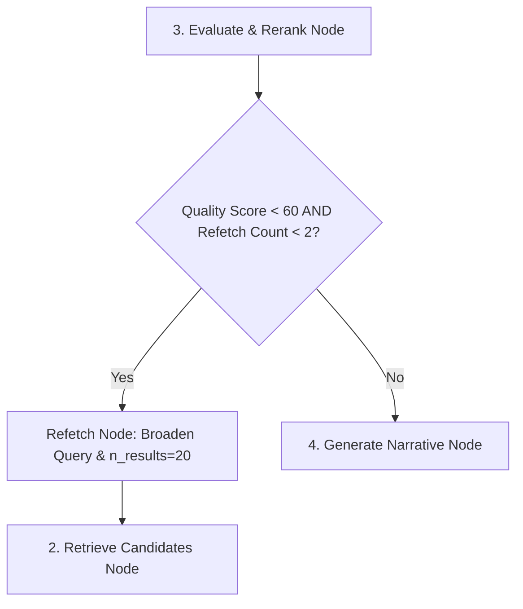

# SmartReco 2026 — LangGraph Agent Specification

The recommendation engine is powered by a 5-node LangGraph `StateGraph` with self-correction capabilities.

## State Schema (`AgentState`)

```python
class AgentState(TypedDict):
    user_id: int
    trigger_reason: str
    events_summary: str
    user_profile: Dict[str, Any]
    search_query: str
    candidates: List[Dict[str, Any]]
    quality_score: int
    refetch_count: int
    final_narrative: str
    recommended_product_ids: List[int]
    metadata: Dict[str, Any]
```

## Node Specifications

### Node 1: `analyze_behavior_node`
- **LLM**: Mesh API (`openai/gpt-4o-mini`, `temperature=0.3`)
- **Task**: Analyzes user's interaction logs to output `user_profile` (interests, skill level, intent) and a vector `search_query`.

### Node 2: `retrieve_candidates_node`
- **Vector DB**: ChromaDB with `MeshEmbeddingFunction` (`openai/text-embedding-3-small`)
- **Task**: Performs similarity search over course embeddings. Retrieves `n_results=15` (or `20` during refetch loops).

### Node 3: `evaluate_and_rerank_node`
- **LLM**: Mesh API (`openai/gpt-4o-mini`, `temperature=0.2`)
- **Task**: Scores relevance of retrieved candidates (0-100), selects top 3-5 product IDs, and sets `needs_refetch=True` if `quality_score < 60`.

### Node 4: `generate_narrative_node`
- **LLM**: Mesh API (`openai/gpt-4o`, `temperature=0.7`)
- **Task**: Crafts a persuasive 150-250 word markdown narrative following the AIDA (Attention, Interest, Desire, Action) copywriting framework.

### Node 5: `store_node`
- **Database & Cache**: SQLite persistence & In-Memory TTL Cache (1hr expiry)
- **Task**: Deactivates previous recommendation records, stores new recommendation, and updates user profile state.

## Self-Correction Refetch Loop


