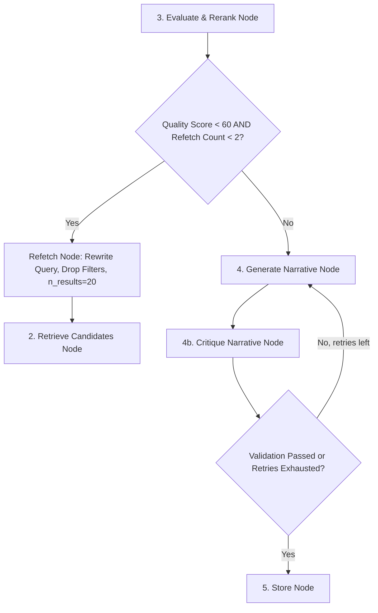

# SmartReco 2026 — LangGraph Agent Specification

The recommendation engine is powered by a LangGraph `StateGraph` with self-correction capabilities: 6 workflow nodes (analyze → retrieve → evaluate → generate → critique → store) plus a `refetch_broaden` loop node.

## Config-driven models

Model names come from `app.config.Settings` (`.env`), defaulting to the free Mesh API models:

- `DEFAULT_CHAT_MODEL`: `tencent/hy3` (analysis + evaluation + query rewrite)
- `MAIN_CHAT_MODEL`: `tencent/hy3` (narrative generation)
- `DEFAULT_EMBEDDING_MODEL`: `sentence-transformers/all-minilm-l6-v2` (ChromaDB retrieval)

## State Schema (`AgentState`)

```python
class AgentState(TypedDict):
    user_id: int
    trigger_reason: str
    events_summary: str
    recurring_patterns: str
    current_behavior_hash: str
    user_profile: Dict[str, Any]
    user_skills: List[str]
    persuasion_style: str        # analytical | social | motivational | practical | hybrid
    search_query: str
    candidates: List[Dict[str, Any]]
    quality_score: int
    refetch_count: int
    drop_filters: bool
    final_narrative: str
    recommended_product_ids: List[int]
    product_reasons: List[str]
    critique_retry_count: int
    critique_feedback: str
    validation_passed: bool
    metadata: Dict[str, Any]
```

## Node Specifications

### Node 1: `analyze_behavior_node`
- **LLM**: Mesh API (`DEFAULT_CHAT_MODEL`, `temperature=0.3`)
- **Task**: Analyzes user's interaction logs to output `user_profile` (interests, skill level, intent), a vector `search_query`, inferred `user_skills`, and a `persuasion_style`.

### Node 2: `retrieve_candidates_node`
- **Vector DB**: ChromaDB with `MeshEmbeddingFunction` (`DEFAULT_EMBEDDING_MODEL`)
- **Task**: Performs similarity search over course embeddings with metadata filters (level, mapped categories). Retrieves `n_results=15` (`20` during refetch loops). Falls back to unfiltered search when filtered search returns nothing; penalizes candidates with unmet prerequisites.

### Node 3: `evaluate_and_rerank_node`
- **LLM**: Mesh API (`DEFAULT_CHAT_MODEL`, `temperature=0.2`)
- **Task**: Scores relevance of retrieved candidates (0-100), selects top 5 product IDs **validated against the retrieved candidate set** (LLM-hallucinated IDs are dropped), and sets `needs_refetch=True` if `quality_score < 60`. Product reasons use deterministic templates (no extra LLM call).

### Node 3b: `refetch_broaden_node`
- **LLM**: Mesh API (`DEFAULT_CHAT_MODEL`, `temperature=0.5`) — query rewrite attempt
- **Task**: Rewrites the search query (best-effort) and sets `drop_filters=True` to widen the candidate pool; increments `refetch_count`. Wired via the conditional edge out of `evaluate`.

### Node 4: `generate_narrative_node`
- **LLM**: Mesh API (`MAIN_CHAT_MODEL`, `temperature=0.7`)
- **Task**: Crafts a persuasive 150-280 word markdown narrative following AIDA (Attention, Interest, Desire, Action). Picks a prompt variant by `persuasion_style`; appends `NARRATIVE_FIX_INSTRUCTION` when regenerating after a critique failure.

### Node 4b: `critique_narrative_node`
- **Task**: Rule-based validation (≥100 words, mentions ≥1 recommended course title). Failed → `critique_retry_count` +1 and feedback; the graph retries `generate` up to 2 times (`should_retry_or_store`), then forces `store`.

### Node 5: `store_node`
- **Database & Cache**: SQLite persistence & In-Memory TTL Cache (1hr expiry)
- **Task**: Deactivates previous recommendation records, stores new recommendation, updates user profile (interests, skill level, intent, `behavior_hash`), clears and re-populates the `active_rec:<user_id>` cache.

## Self-Correction Refetch Loop

