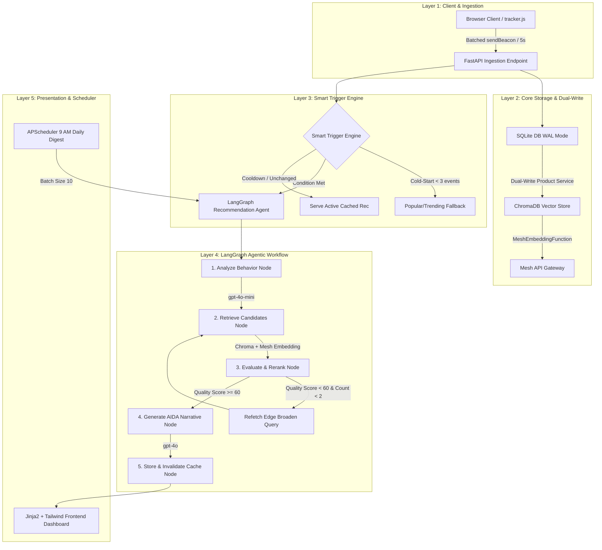

# SmartReco 2026 — System Architecture

SmartReco 2026 is an agentic, personalized course recommendation platform designed to turn user behavior (clicks, dwell time, searches, views) into real-time persuasive recommendation narratives.

## Architectural Rationale

1. **Mesh API Gateway Compliance**:
   All LLM calls (`openai/gpt-4o-mini`, `openai/gpt-4o`) and Embedding queries/indexing (`openai/text-embedding-3-small`) pass strictly through `https://api.meshapi.ai/v1`.
2. **Dual-Write Integrity**:
   Product modifications insert/update SQLite via SQLAlchemy transactions first, followed by ChromaDB upsert via custom `MeshEmbeddingFunction`.
3. **Non-Blocking Client Tracking**:
   `tracker.js` batches events in-memory, flushing every 5 seconds or 20 events. `navigator.sendBeacon` guarantees delivery even when navigating across pages.
4. **Smart Triggering & Cooldowns**:
   Prevents unnecessary LLM costs by enforcing a 10-minute cooldown and behavior hash comparison, evaluating 6 trigger conditions before invoking the 5-node agent graph.
5. **Self-Correction Refetch Loop**:
   If candidate quality score evaluates below 60, the agent loops back up to 2 times, broadening search queries and parameter bounds.
